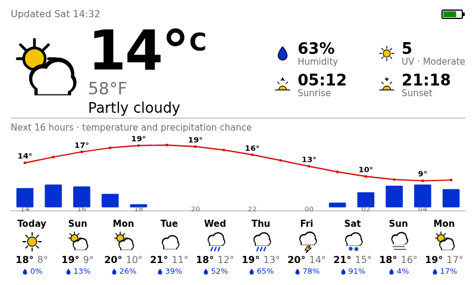
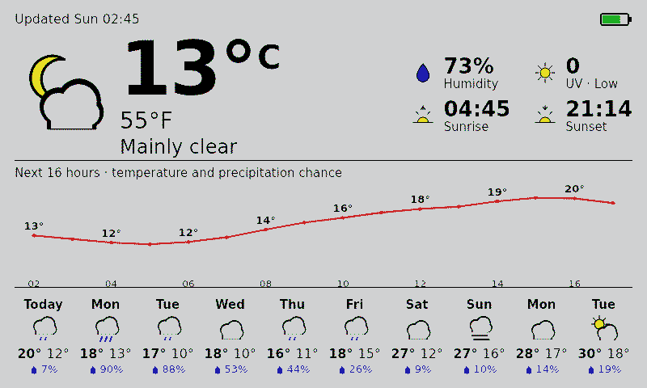

# WeatherDisplay

A battery-powered e-ink weather station for the Raspberry Pi. It wakes itself
every few hours, fetches the forecast from [Open-Meteo](https://open-meteo.com),
renders a clean dashboard, paints it onto a 6-colour e-ink panel, and powers
itself back off to sip battery.



Current conditions (°C **and** °F), humidity, UV index and sunrise/sunset; a
16-hour temperature + precipitation chart; and a 10-day strip of min/max and
rain-chance chips. The last-update time and a battery gauge sit in the header
(the gauge turns red below 20%). If an update fails, the previous screen is kept
and an error banner explains what went wrong.

> [](https://ailabels.org/#made-primarily-by-ai)

## Hardware

| Part                                                     | Notes                                                                                              |
| -------------------------------------------------------- | -------------------------------------------------------------------------------------------------- |
| Raspberry Pi Zero 2 W                                    | Any 40-pin Pi works; the Zero 2 W is the low-power target.                                         |
| Pimoroni Inky Impression 7.3" (2025, Spectra 6 / PIM773) | 800×480, 6-colour e-ink.                                                                           |
| PiSugar 3 Plus                                           | Battery + RTC that powers the Pi on/off on a schedule.                                             |
| microSD card                                             | Raspberry Pi OS — 64-bit on 64-bit-capable boards; 32-bit (armhf) on ARMv7 boards like the Pi 2 B. |

### Assembly

1. **Flash Raspberry Pi OS** and complete first boot, networking and SSH. Use
   64-bit on 64-bit-capable boards; on ARMv7 boards like the Pi 2 B (which can't
   run 64-bit) use the 32-bit/armhf image. Boards without onboard WiFi (e.g. the
   Pi 2 B) need Ethernet or a USB WiFi dongle. Set the correct **timezone**
   (`sudo raspi-config` → Localisation) — the wake schedule and sunrise/sunset
   rely on it.
2. **Attach the PiSugar 3 Plus** to the back of the Pi and connect the battery.
   Follow Pimoroni/PiSugar's guide:
   <https://github.com/PiSugar/PiSugar/wiki/PiSugar-3-series>. Keep the PiSugar
   **hardware power switch ON** — the RTC needs it on to power the Pi back up.
3. **Install the PiSugar power manager** (provides the `pisugar-server` the app
   talks to):
   ```bash
   curl https://cdn.pisugar.com/release/pisugar-power-manager.sh | sudo bash
   ```
   See <https://docs.pisugar.com/docs/product-wiki/battery/pisugar-power-manager>.
4. **Seat the Inky Impression** on the 40-pin header (it comes fully assembled,
   no soldering). Pimoroni's getting-started guide:
   <https://learn.pimoroni.com/article/getting-started-with-inky-impression>.

> The correct setup would have the e-ink display connected to the 40 pins of your Pi, and the Pi connected to the PiSugar behind it

## Software install

Clone the repo onto the Pi and run the installer:

```bash
git clone <this-repo> ~/WeatherDisplay
cd ~/WeatherDisplay
./install.sh
```

`install.sh` is **idempotent** — re-run it any time. It will:

- enable the **SPI** bus (needed by the Inky) and the `spi0-0cs` overlay,
- install **fonts**, the OS **Python 3.13+** (`python3` + `python3-venv`),
  **numpy** and **Pillow** (`python3-numpy` + `python3-pil`), and a small build
  toolchain via apt — the heavy binary deps come prebuilt so nothing slow is
  compiled on the Pi,
- ensure ~1 GB of **swap** (headroom for any native pip build on low-RAM Pis
  like the 512 MB Zero 2 W),
- create a **virtualenv** from the newest installed **Python ≥ 3.13**, with
  `--system-site-packages` so it sees the apt numpy/Pillow, and install
  WeatherDisplay (with the `[pi]` hardware extra),
- create **`config.toml`** from the example,
- check that **`pisugar-server`** is reachable, and
- install + enable the **systemd service**.

Each step checks whether it is already done and prints an actionable error with
a suggested fix if something goes wrong.

After it finishes, **edit your settings**:

```bash
nano config.toml      # set latitude, longitude, timezone
```

## Configuration

`config.toml` is a flat TOML file (see [`config.example.toml`](config.example.toml)
for the documented version). Key settings:

| Key                     | Meaning                                                  |
| ----------------------- | -------------------------------------------------------- |
| `latitude`, `longitude` | Location for the forecast.                               |
| `timezone`              | IANA name, e.g. `Europe/London`.                         |
| `primary_unit`          | `metric` (°C large) or `imperial` (°F large).            |
| `saturation`            | E-ink colour saturation, `0.0`–`1.0`.                    |
| `chart_hours`           | Hours in the temperature/precip chart (1–48).            |
| `day_chips`             | Number of day chips (1–16).                              |
| `wake_interval_hours`   | How often it wakes and updates.                          |
| `auto_shutdown`         | Power off after each update (set `false` while testing). |

## Usage

The systemd service runs automatically on each boot (the PiSugar provides the
"every N hours"). To run an update by hand:

```bash
.venv/bin/weatherdisplay --config config.toml update
```

While bringing it up, set `auto_shutdown = false` so it does not power off, and
watch the logs (see below). Re-enable it when you are happy.

### Logs

The service logs to the **systemd journal**:

```bash
journalctl -u weatherdisplay -f
```

Set `verbose = true` in the config for DEBUG-level detail.

### Maintenance / staying awake

Because the device powers off after each update, create a sentinel file to keep
it awake (so you can SSH in) — it is checked at the end of each update:

```bash
sudo touch /boot/firmware/weatherdisplay-stayawake   # skip auto-shutdown
sudo rm    /boot/firmware/weatherdisplay-stayawake    # resume normal operation
```

## Dev mode (design without a Raspberry Pi)

On any machine with Python 3.13+ you can iterate on the design without a Pi:

```bash
pip install -e ".[dev]"
weatherdisplay --config config.toml dev
```

Open <http://localhost:8080>. It shows the **rendered panel image** as the
faithful 6-colour e-ink simulation. Buttons switch between **weather presets**
(rainy, snowy, hot, cold, …) or a **live** fetch; a battery field previews the
gauge (red below 20%); and you can **drag-and-drop a `.ttf`** onto the Title or
Body target to hot-swap the font. The server restarts on code edits and the
image refreshes on its own, so changes to the renderer, icons, fonts or presets
show up immediately.



## Development

```bash
ruff check . && ruff format --check .   # lint + format (Google style, 80 col)
pyrefly check                           # type-check
pytest                                  # tests
```

The code follows the
[Google Python Style Guide](https://google.github.io/styleguide/pyguide.html).
The hardware-only `inky` dependency is isolated in the `[pi]` extra, so
everything except the final panel push runs and is tested on a normal machine.

## How it works

```
PiSugar RTC powers on  ->  systemd runs `weatherdisplay update`
   -> read battery (PiSugar TCP :8423)
   -> fetch forecast (Open-Meteo JSON)
   -> draw the 800×480 image directly with Pillow (pixel fonts + pixel-art icons)
   -> push to Inky (or, on error, overlay a banner on the last good screen)
   -> schedule next PiSugar wake-up  ->  power off
```

## License

ISC — see [LICENSE](LICENSE).
